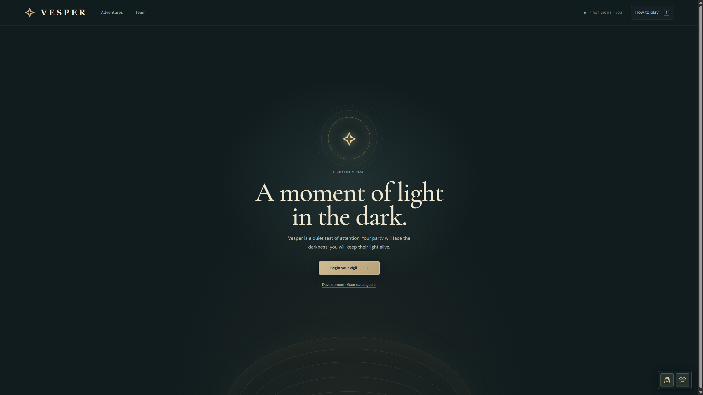
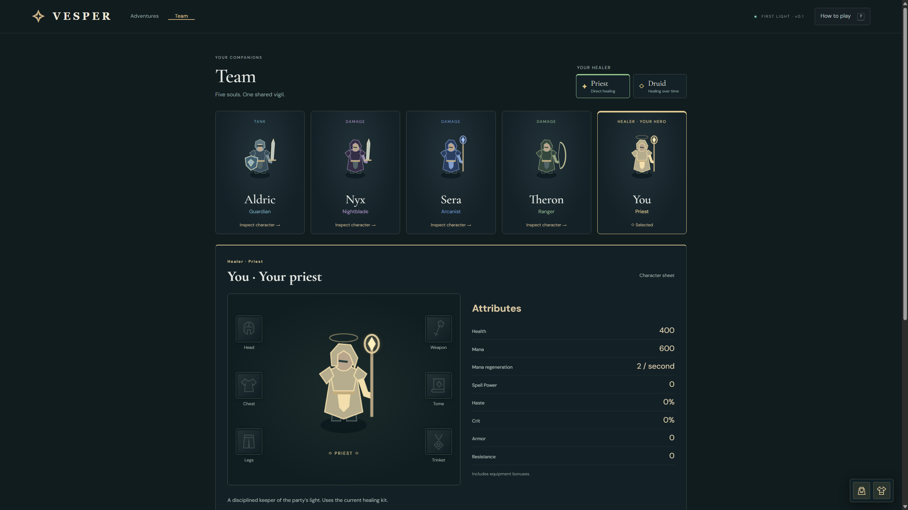
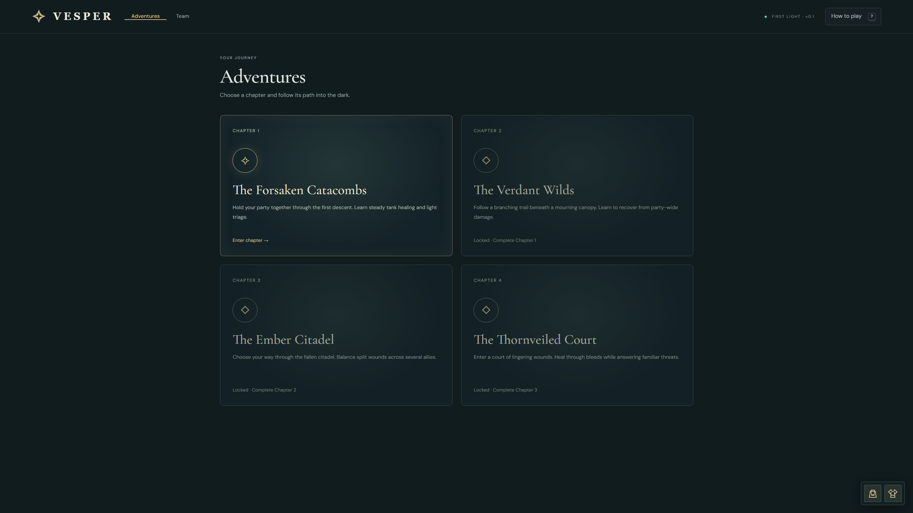
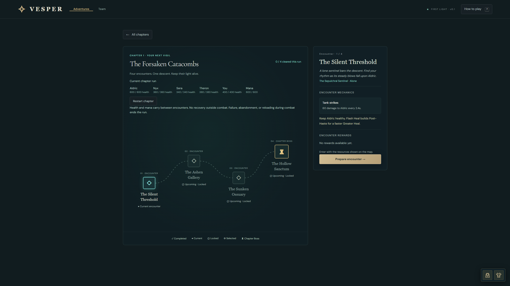
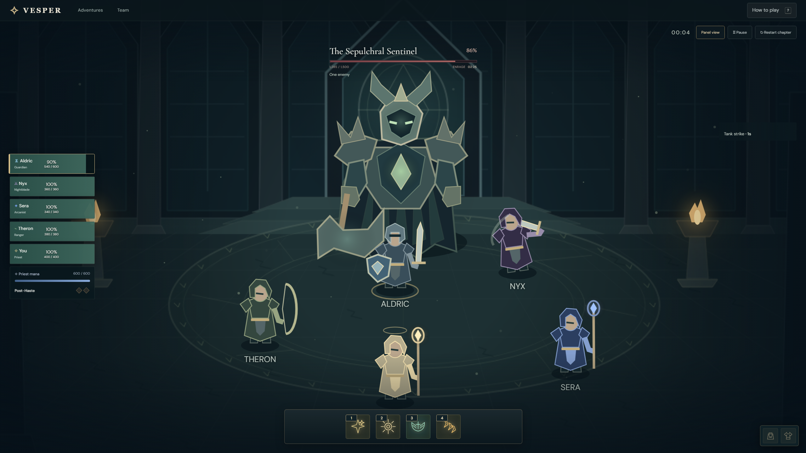

# ✦ Vesper — A Healer's Vigil

> **Vesper is in the very early stages of development.** Expect active iteration as its combat, progression, and presentation take shape.

A browser-based dungeon-healing game about keeping a five-person party alive through a dark, deliberate encounter. Step into the role of a Priest, read each threat, spend mana carefully, and keep the party's light burning against the Hollow Warden.


---

## 🌍 Overview

Vesper is a focused healing encounter for desktop browsers. The party fights automatically while you choose targets, manage cast times and mana, and respond to predictable boss mechanics. The current playable slice follows a Priest and four companions into the Forsaken Catacombs to face the Hollow Warden.

The game supports both a detailed panel layout and an immersive battlefield view, with keyboard-first healing controls and a responsive layout for narrower screens.

---

## Built with Codex

Vesper is being developed through collaboration with OpenAI Codex. It is a practical exploration of AI-assisted game development: using the tool to help plan, implement, test, and refine a small, systems-driven game while retaining hands-on creative and technical direction.

---

## 🚧 Status

> **Active development** — The first Priest encounter, party selection, chapter map, team view, equipment catalogue, and immersive combat presentation are playable. Progression, more chapters, additional healing kits, sound, and saved progression are still in development.

---

## ✨ Features

- **Tactical healing** — Heal five distinct party members with targeted, cast-time-based Priest spells.
- **Readable encounter design** — Learn deterministic enemy abilities, warnings, damage-over-time, and timing windows.
- **Mana and haste management** — Balance a finite mana pool with passive regeneration and Post-Haste charges.
- **Distinct healing kit** — Use Flash Heal, Greater Heal, Prayer of Healing, and multi-bolt Penance.
- **Party and healer views** — Review the team, select a healer, and inspect character attributes.
- **Chapter journey** — Enter the Forsaken Catacombs and follow its encounter path.
- **Immersive combat** — Switch between a detailed control panel and a full-window battlefield without losing encounter state.
- **Keyboard-first controls** — Select targets with the mouse or arrow keys, cast with 1–4, pause with Space, and cancel with Esc.

---

## 🛠️ Tech Stack

- [JavaScript](https://developer.mozilla.org/docs/Web/JavaScript) — ES modules and game logic
- [HTML](https://developer.mozilla.org/docs/Web/HTML) — Application structure
- [CSS](https://developer.mozilla.org/docs/Web/CSS) — Responsive layouts and visual presentation
- [Canvas API](https://developer.mozilla.org/docs/Web/API/Canvas_API) — Battlefield, character, and spell rendering
- [Node.js](https://nodejs.org/) — Dependency-free local development server and test runner

---

## 📸 Preview

### Enter the vigil and meet your party

<p align="center">
  
  
</p>

### Choose a chapter and prepare the next encounter

<p align="center">
  
  
</p>

### Face the Sepulchral Sentinel

<p align="center">
  
</p>

---

## 🚀 Run Locally

### Prerequisites

- [Node.js](https://nodejs.org/) 20.11 or newer

### Start the game

```bash
git clone https://github.com/Zanny7/vesper.git
cd vesper
npm start
```

Open [http://localhost:5173](http://localhost:5173) in your browser. On Windows, if PowerShell blocks `npm.ps1`, use `npm.cmd start`.

### Run the tests

```bash
npm test
```

The deterministic test suite covers healing, casts, cooldowns, mana, encounter schedules, pause/reset behavior, and encounter feasibility.

---

## 🎮 How to Play

- Choose **Begin your vigil**, then open **Adventures** and enter the Forsaken Catacombs.
- Select a party member by clicking their frame or pressing **↑** / **↓**.
- Cast spells with **1–4** or by clicking an ability; hover a party frame to direct keyboard casts to that ally.
- Press **Space** to pause or resume, **Esc** to cancel a cast, and **?** to open the field guide.
- Keep the tank and Priest alive, maintain at least three allies, and defeat the Warden before the encounter timer expires.

---

## 🙏 Credits & Disclaimer

- Character, environment, and spell artwork is original procedural Canvas/SVG art created for Vesper.
- The interface uses [DM Sans](https://fonts.google.com/specimen/DM+Sans) and [Cormorant Garamond](https://fonts.google.com/specimen/Cormorant+Garamond), with local system fallbacks.
- Vesper is an independent early-stage project and is not affiliated with any third-party game or game property.

---

Built by [@Zanny7](https://github.com/Zanny7).
